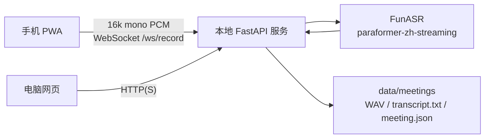

# 秒记架构边界

本文档是项目防漂移基线。除非明确升级架构，否则后续改动应保持这里的约束。

## 目标

```text
手机放桌上录音
-> 本地电脑免费实时转写
-> 页面边录边显示文字
-> 本地保存音频和逐字稿
-> 电脑/手机都能查看
```

第一阶段只证明核心链路能稳定跑长会议：录音、传输、流式转写、实时显示、落盘。

## 固定架构



## 模块职责

- `web/`：原生 PWA。负责麦克风采集、重采样为 16k 单声道 PCM、WebSocket 发送、实时 UI。
- `server/`：FastAPI 本地服务。负责 HTTP API、WebSocket、调用转写器、保存数据。
- `server/asr.py`：唯一 ASR 接入层。第一阶段真实模型固定为 `FunASR paraformer-zh-streaming`。
- `server/storage.py`：本地文件存储。会议数据固定保存在 `data/meetings/<meeting_id>/`。
- `scripts/`：Windows 安装、启动、自检、验证脚本。
- `docs/`：架构、路线和运维说明。
- `tests/`：核心链路回归测试。

## 不漂移约束

- 不引入 Node/Vite/React/Vue 构建链，除非明确进入前端重构阶段。
- 不把第一阶段 ASR 主链路换成云端 ASR、Qwen3-ASR 或浏览器内 ASR。
- 不新增远程数据库。历史会议继续先用本地文件保存。
- 不要求 Docker 才能运行。Windows 原生 PowerShell + Python 是默认路径。
- 不把实时摘要塞进转写 WebSocket 的强依赖里。第二阶段摘要应作为独立 worker 或服务内后台任务。
- 不把会后总结作为第一阶段启动前置条件。
- 不在业务代码里硬编码个人机器路径。

## 允许演进

- 增加 LM Studio / 讯飞星辰摘要 worker，但输入必须来自已保存 transcript segment。
- 增加 Markdown / Word / PDF 导出，但不改变 `meeting.json` 主存储结构。
- 增加受信任证书方案，例如 mkcert，但保留自签证书 fallback。
- 增加 Windows 防火墙辅助脚本，但必须显式提示用户。
- 增加可选 GPU 配置，但 CPU 必须继续可用。

## 数据契约

每场会议目录：

```text
data/meetings/<meeting_id>/
  audio.wav
  transcript.txt
  meeting.json
```

`meeting.json` 必须保留：

```json
{
  "id": "",
  "title": "",
  "created_at": "",
  "updated_at": "",
  "status": "recording|finished",
  "sample_rate": 16000,
  "duration_seconds": 0,
  "transcript": [],
  "rolling_summary": {
    "会议摘要": [],
    "决策事项": [],
    "待办事项": [],
    "每个人负责什么": [],
    "风险/问题": []
  }
}
```

## 验证基线

每次改动后至少运行：

```powershell
.\scripts\verify.ps1
```

它应覆盖：

- Python 编译检查
- 标准库单元测试
- 前端 JS 语法检查
- 架构守卫
